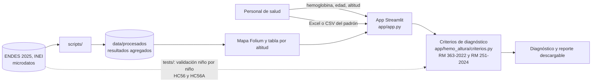

# Arquitectura *(en construcción)*

```mermaid
flowchart LR
    U[Personal de salud] -->|hemoglobina, edad, altitud| A[App Streamlit<br/>app/app.py]
    U -->|Excel o CSV del padrón| A
    A --> C[Criterios de diagnóstico<br/>app/hemo_altura/criterios.py<br/>RM 363-2022 y RM 251-2024]
    C --> R[Diagnóstico y reporte descargable]
    E[(ENDES 2025, INEI<br/>microdatos)] --> S[scripts/]
    S --> D[(data/procesados<br/>resultados agregados)]
    D --> M[Mapa Folium y tabla por altitud]
    M --> A
    E -.->|tests/: validación niño por niño<br/>HC56 y HC56A| C
```

No hay base de datos ni APIs externas: el padrón que sube el establecimiento se procesa en memoria y no se guarda.
